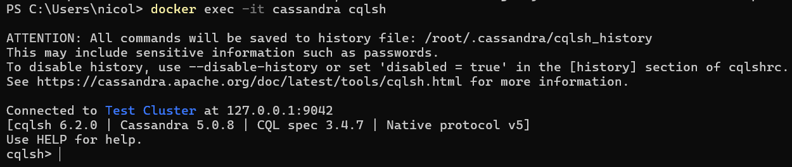
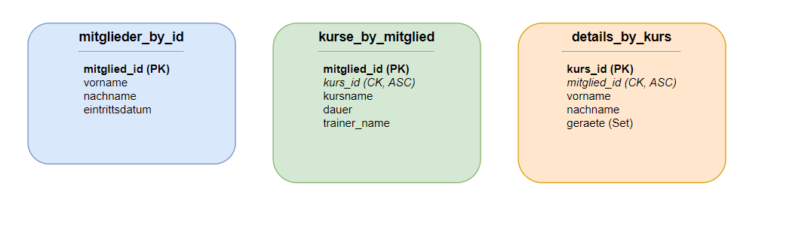
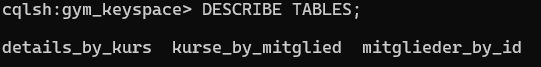

## A) Installation / Account erstellen

Für diesen Teil wurde Cassandra via Docker installiert und gestartet. Nach einer kurzen Wartezeit für das Hochfahren der Datenbank konnte ich mich erfolgreich mit `cqlsh` verbinden.



---

## B) Logisches Modell für Cassandra

Für unser Gym-Datenmodell (basierend auf Kursen, Mitgliedern und Geräten aus den vorherigen MongoDB-Aufträgen) wurden die folgenden drei Haupt-Screens definiert. Da Cassandra abfrageorientiert ist (Query-Driven Data Modeling), wird für jeden Screen eine massgeschneiderte Tabelle erstellt.



### Erklärung der Abläufe, Szenarien und Screens

**Screen 1: Profil des Mitglieds anzeigen**

- **Szenario:** Ein Mitglied loggt sich in der Gym-App ein. Auf der Startseite sollen die persönlichen Daten (Name, Eintrittsdatum) angezeigt werden.
- **Benötigte Daten:** Vorname, Nachname, Eintrittsdatum.
- **Tabelle:** `mitglieder_by_id`
- **Partition Key:** `mitglied_id` (Jedes Mitglied hat eine eigene Partition, Abfrage erfolgt über diese ID).
- **Clustering Key:** Keiner benötigt, da wir pro ID nur einen Datensatz erwarten.

**Screen 2: Meine gebuchten Kurse (Sicht des Mitglieds)**

- **Szenario:** Das Mitglied navigiert zum Reiter "Meine Kurse", um zu sehen, welche Kurse es gebucht hat, inklusive der Kursdetails und des Trainers.
- **Benötigte Daten:** Kurs-ID, Kursname, Dauer, Trainer-Name.
- **Tabelle:** `kurse_by_mitglied`
- **Partition Key:** `mitglied_id` (Damit wir sofort alle Kurse dieses einen Mitglieds finden).
- **Clustering Key:** `kurs_id` (ASC) (Damit die Kurse innerhalb der Partition eindeutig sind und sortiert abgelegt werden).

**Screen 3: Kurs-Verwaltung und Teilnehmerliste (Sicht des Trainers)**

- **Szenario:** Ein Trainer klickt auf einen seiner Kurse (z.B. "Yoga"), um zu sehen, welche Mitglieder angemeldet sind und welche Geräte bereitgestellt werden müssen.
- **Benötigte Daten:** Mitglied-Vorname, Mitglied-Nachname, benötigte Geräte (als Liste/Set).
- **Tabelle:** `details_by_kurs`
- **Partition Key:** `kurs_id` (Alle Infos zu einem spezifischen Kurs liegen zusammen auf einem Node).
- **Clustering Key:** `mitglied_id` (ASC) (Um die Mitgliederliste des Kurses geordnet auszugeben).

---

## C) Physisches Modell für Cassandra

Das logische Modell wurde mit folgendem CQL-Skript in die Datenbank übertragen. Dabei wurde zunächst der Keyspace erstellt und anschliessend die drei Tabellen für die Screens definiert.

```sql
-- 1. Keyspace (Datenbank) erstellen
CREATE KEYSPACE IF NOT EXISTS gym_keyspace
WITH replication = {'class': 'SimpleStrategy', 'replication_factor': 1};

-- 2. Keyspace auswählen
USE gym_keyspace;

-- 3. Tabelle für Screen 1: Profil des Mitglieds anzeigen
CREATE TABLE IF NOT EXISTS mitglieder_by_id (
    mitglied_id uuid,
    vorname text,
    nachname text,
    eintrittsdatum date,
    PRIMARY KEY (mitglied_id)
);

-- 4. Tabelle für Screen 2: Meine gebuchten Kurse
CREATE TABLE IF NOT EXISTS kurse_by_mitglied (
    mitglied_id uuid,
    kurs_id uuid,
    kursname text,
    dauer int,
    trainer_name text,
    PRIMARY KEY ((mitglied_id), kurs_id)
) WITH CLUSTERING ORDER BY (kurs_id ASC);

-- 5. Tabelle für Screen 3: Kurs-Verwaltung (Sicht Trainer)
CREATE TABLE IF NOT EXISTS details_by_kurs (
    kurs_id uuid,
    mitglied_id uuid,
    vorname text,
    nachname text,
    geraete set<text>,
    PRIMARY KEY ((kurs_id), mitglied_id)
) WITH CLUSTERING ORDER BY (mitglied_id ASC);
```

