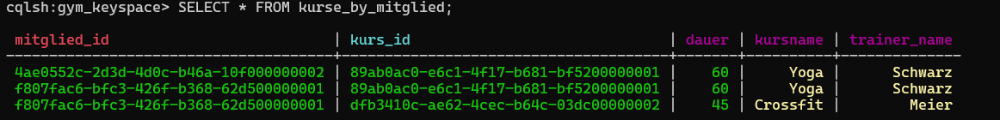
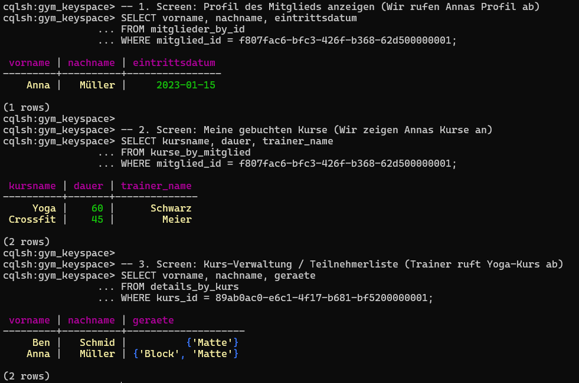
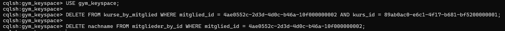
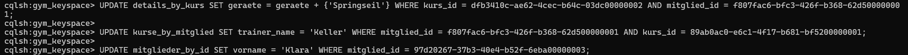
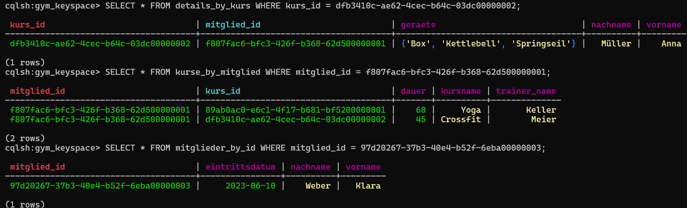

## A) Daten hinzufügen

Um die Tabellen zu füllen, habe ich Datensätze für drei Mitglieder, deren Kurse und die entsprechenden Kursdetails hinzugefügt. Dabei wurde darauf geachtet, dass pro Partition Key mehrere Datensätze vorhanden sind (z.B. besucht Anna zwei Kurse).

**Skript (`Skripts/insert.sql`):**

```sql
USE gym_keyspace;

-- Mitglieder
INSERT INTO mitglieder_by_id (mitglied_id, vorname, nachname, eintrittsdatum) VALUES (f807fac6-bfc3-426f-b368-62d500000001, 'Anna', 'Müller', '2023-01-15');
INSERT INTO mitglieder_by_id (mitglied_id, vorname, nachname, eintrittsdatum) VALUES (4ae0552c-2d3d-4d0c-b46a-10f000000002, 'Ben', 'Schmid', '2023-03-20');
INSERT INTO mitglieder_by_id (mitglied_id, vorname, nachname, eintrittsdatum) VALUES (97d20267-37b3-40e4-b52f-6eba00000003, 'Clara', 'Weber', '2023-06-10');

-- Kurse
INSERT INTO kurse_by_mitglied (mitglied_id, kurs_id, kursname, dauer, trainer_name) VALUES (f807fac6-bfc3-426f-b368-62d500000001, 89ab0ac0-e6c1-4f17-b681-bf5200000001, 'Yoga', 60, 'Schwarz');
INSERT INTO kurse_by_mitglied (mitglied_id, kurs_id, kursname, dauer, trainer_name) VALUES (f807fac6-bfc3-426f-b368-62d500000001, dfb3410c-ae62-4cec-b64c-03dc00000002, 'Crossfit', 45, 'Meier');
INSERT INTO kurse_by_mitglied (mitglied_id, kurs_id, kursname, dauer, trainer_name) VALUES (4ae0552c-2d3d-4d0c-b46a-10f000000002, 89ab0ac0-e6c1-4f17-b681-bf5200000001, 'Yoga', 60, 'Schwarz');

-- Details
INSERT INTO details_by_kurs (kurs_id, mitglied_id, vorname, nachname, geraete) VALUES (89ab0ac0-e6c1-4f17-b681-bf5200000001, f807fac6-bfc3-426f-b368-62d500000001, 'Anna', 'Müller', {'Matte', 'Block'});
INSERT INTO details_by_kurs (kurs_id, mitglied_id, vorname, nachname, geraete) VALUES (89ab0ac0-e6c1-4f17-b681-bf5200000001, 4ae0552c-2d3d-4d0c-b46a-10f000000002, 'Ben', 'Schmid', {'Matte'});
INSERT INTO details_by_kurs (kurs_id, mitglied_id, vorname, nachname, geraete) VALUES (dfb3410c-ae62-4cec-b64c-03dc00000002, f807fac6-bfc3-426f-b368-62d500000001, 'Anna', 'Müller', {'Kettlebell', 'Box'});
```



---

## B) Daten abfragen

Für die in KN-C-01 definierten Screens wurden folgende Abfragen ausgeführt:

**Skript (`Skripts/select.sql`):**

```sql
SELECT vorname, nachname, eintrittsdatum FROM mitglieder_by_id WHERE mitglied_id = f807fac6-bfc3-426f-b368-62d500000001;
SELECT kursname, dauer, trainer_name FROM kurse_by_mitglied WHERE mitglied_id = f807fac6-bfc3-426f-b368-62d500000001;
SELECT vorname, nachname, geraete FROM details_by_kurs WHERE kurs_id = 89ab0ac0-e6c1-4f17-b681-bf5200000001;
```



---

## C) Daten löschen

Es wurde ein Skript erstellt, um gezielt einen Kurs sowie eine einzelne Spalte (`nachname`) zu löschen. Ein zweites Skript wurde genutzt, um die Tabellen für weitere Tests komplett zu leeren.

**Skript (`Skripts/delete.sql`):**

```sql
-- Spezifische Daten löschen
DELETE FROM kurse_by_mitglied WHERE mitglied_id = 4ae0552c-2d3d-4d0c-b46a-10f000000002 AND kurs_id = 89ab0ac0-e6c1-4f17-b681-bf5200000001;
DELETE nachname FROM mitglieder_by_id WHERE mitglied_id = 4ae0552c-2d3d-4d0c-b46a-10f000000002;

-- Tabellen komplett leeren (Aufräumen)
TRUNCATE mitglieder_by_id;
TRUNCATE kurse_by_mitglied;
TRUNCATE details_by_kurs;
```



---

## D) Daten verändern

Für die Updates wurden drei anspruchsvollere Szenarien definiert und umgesetzt:

1. **Gerät zu Set hinzufügen:** Für den Crossfit-Kurs von Anna wird spontan ein neues Trainingsgerät ('Springseil') dem bestehenden Set hinzugefügt, ohne die anderen Elemente zu überschreiben.
2. **Trainer-Stellvertretung:** Trainer Schwarz ist krank. Für Annas Yoga-Kurs wird der Name des Trainers auf die Stellvertretung ('Keller') aktualisiert.
3. **Tippfehler korrigieren:** Beim Erfassen von Clara wurde ihr Vorname falsch geschrieben. Er wird nachträglich auf 'Klara' korrigiert.

**Skript Updates:**

```sql
UPDATE details_by_kurs SET geraete = geraete + {'Springseil'} WHERE kurs_id = dfb3410c-ae62-4cec-b64c-03dc00000002 AND mitglied_id = f807fac6-bfc3-426f-b368-62d500000001;
UPDATE kurse_by_mitglied SET trainer_name = 'Keller' WHERE mitglied_id = f807fac6-bfc3-426f-b368-62d500000001 AND kurs_id = 89ab0ac0-e6c1-4f17-b681-bf5200000001;
UPDATE mitglieder_by_id SET vorname = 'Klara' WHERE mitglied_id = 97d20267-37b3-40e4-b52f-6eba00000003;
```

  

