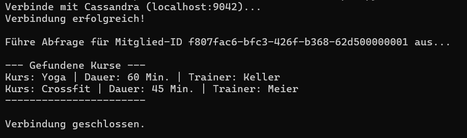

## A) Zugriff via Python-Treiber

Für den programmgesteuerten Zugriff auf die Cassandra-Datenbank habe ich Python verwendet. Dazu wurde der offizielle DataStax-Treiber mit dem Befehl `pip install cassandra-driver` installiert.

Das folgende Skript baut eine Verbindung zum lokalen Cassandra-Container und dem `gym_keyspace` auf. Anschliessend wird eine Abfrage ausgeführt, um die gebuchten Kurse eines spezifischen Mitglieds (Anna, identifiziert über ihre fixe UUID) auszulesen. Die Resultate werden mit `print()`-Befehlen formatiert in der Konsole ausgegeben, um die erfolgreiche Ausführung zu visualisieren.

**Skript (`cassandra_gymdb.py`):**

```python
from cassandra.cluster import Cluster
from uuid import UUID

def main():
    # 1. Verbindung zur lokalen Cassandra Datenbank aufbauen
    print("Verbinde mit Cassandra (localhost:9042)...")
    cluster = Cluster(['127.0.0.1'], port=9042)

    # Direkt mit unserem Keyspace verbinden
    session = cluster.connect('gym_keyspace')
    print("Verbindung erfolgreich!\n")

    # 2. Daten abfragen (Szenario: Annas Kurse anzeigen)
    # Wir verwenden die fixe UUID aus Teil KN-C-02
    anna_id = UUID('f807fac6-bfc3-426f-b368-62d500000001')
    query = "SELECT kursname, dauer, trainer_name FROM kurse_by_mitglied WHERE mitglied_id = %s"

    print(f"Führe Abfrage für Mitglied-ID {anna_id} aus...")
    rows = session.execute(query, [anna_id])

    # 3. Resultate in der Konsole ausgeben
    print("\n--- Gefundene Kurse ---")
    for row in rows:
        print(f"Kurs: {row.kursname} | Dauer: {row.dauer} Min. | Trainer: {row.trainer_name}")
    print("-----------------------\n")

    # 4. Verbindung sauber schliessen
    cluster.shutdown()
    print("Verbindung geschlossen.")

if __name__ == "__main__":
    main()
```


