# KN-M-01: Installation und Verwaltung von MongoDB

---

## A) Installation (30%)

### 1. Cloud-Init Datei

Die Cloud-Init Datei finden Sie im gleichen Ordner.

---

### 2. Compass – Bestehende Datenbanken

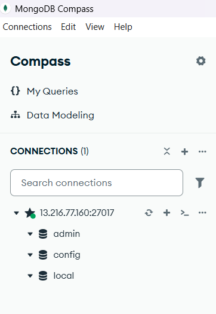

---

### 3. Erklärung: authSource=admin

Der Parameter authSource=admin teilt MongoDB mit, in welcher Datenbank der Benutzer gespeichert ist.
Da ich den Admin-Benutzer mit use admin erstellt habe, ist er in der admin-Datenbank gespeichert. Gebe ich eine andere Datenbank an, findet MongoDB den Benutzer nicht und verweigert die Verbindung

---

### 4. Erklärung: sed Befehle

`sed` (Stream Editor) ist ein Linux-Tool zum automatischen Suchen und Ersetzen von Text in Dateien.

Befehl 1: BindIP ändern:

```bash
sudo sed -i 's/127.0.0.1/0.0.0.0/g' /etc/mongod.conf
```

Ersetzt `127.0.0.1` mit `0.0.0.0`. Ohne diese Änderung akzeptiert MongoDB nur lokale Verbindungen, Compass von einem externen PC würde nicht funktionieren.

Befehl 2: Authentifizierung aktivieren:

```bash
sudo sed -i 's/#security:/security:\n  authorization: enabled/g' /etc/mongod.conf
```

## Aktiviert die Authentifizierung. Ohne diese Änderung kann jeder ohne Login auf die Datenbank zugreifen.

### 5. MongoDB Konfigurationsdatei

[MonboDB Konfigurationen](Images/mongodb_configuration.png)

---

## B) Erste Schritte GUI (30%)

### 1. Dokument vor dem Einfügen

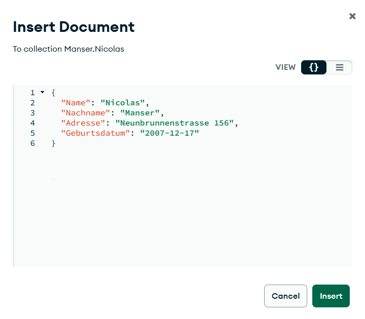

---

### 2. Dokument nach Anpassung des Datentyps

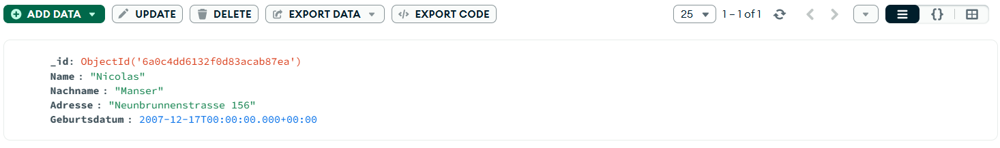

---

### 3. Export-Datei & Erklärung

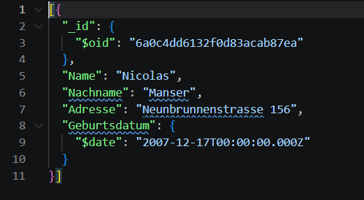

Warum wurde das Datum als String gespeichert?

JSON kennt keinen eigenen Datum-Datentyp. Gibt man "2000-01-01" ein, wird es automatisch als String gespeichert. Um ein Datum direkt korrekt einzufügen, hätte ich das BSON-Format $date verwenden müssen:

Um ein Datum direkt korrekt einzufügen, hätte man das BSON-Format `$date` verwenden müssen:

```json
{ "Geburtsdatum": { "$date": "2000-01-01T00:00:00.000Z" } }
```

Implikationen auf andere Datentypen:
Dasselbe Problem betrifft auch andere Typen. Zum Beispiel würde "180" mit Anführungszeichen als String gespeichert statt als Integer 180. Das kann bei Berechnungen oder Abfragen zu falschen Resultaten führen.

Warum dieser komplizierte Weg?
JSON hat nur wenige Grundtypen (String, Number, Boolean, Array, Object, null). MongoDB erweitert JSON intern mit BSON, um zusätzliche Typen wie Date oder Int32 zu unterstützen – diese müssen jedoch explizit angegeben werden.

---

## C) Erste Schritte Shell (10%)

### Screenshot Compass Shell

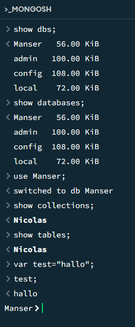

---

### Screenshot MongoDB Shell (Linux-Server)

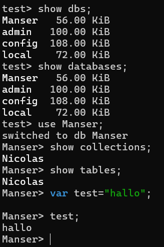

---

### Was machen die Befehle 1–5?

| Befehl             | Funktion                                       |
| ------------------ | ---------------------------------------------- |
| `show dbs`         | Zeigt alle Datenbanken mit Grösse an           |
| `show databases`   | Identisch mit `show dbs`                       |
| `use Manser`       | Wechselt in die Datenbank `Manser`             |
| `show collections` | Zeigt alle Collections der aktuellen Datenbank |
| `show tables`      | Identisch mit `show collections` (SQL-Alias)   |

### Unterschied: Collections vs. Tables

Tables (SQL): Daten sind in festen Zeilen und Spalten gespeichert. Jede Zeile hat dieselbe Struktur (strenges Schema).

Collections (MongoDB/NoSQL): Speichern flexible JSON-Dokumente ohne festes Schema. Dokumente in derselben Collection können unterschiedliche Felder haben.

---

## D) Rechte und Rollen (30%)

### 1. Fehler bei falscher authSource

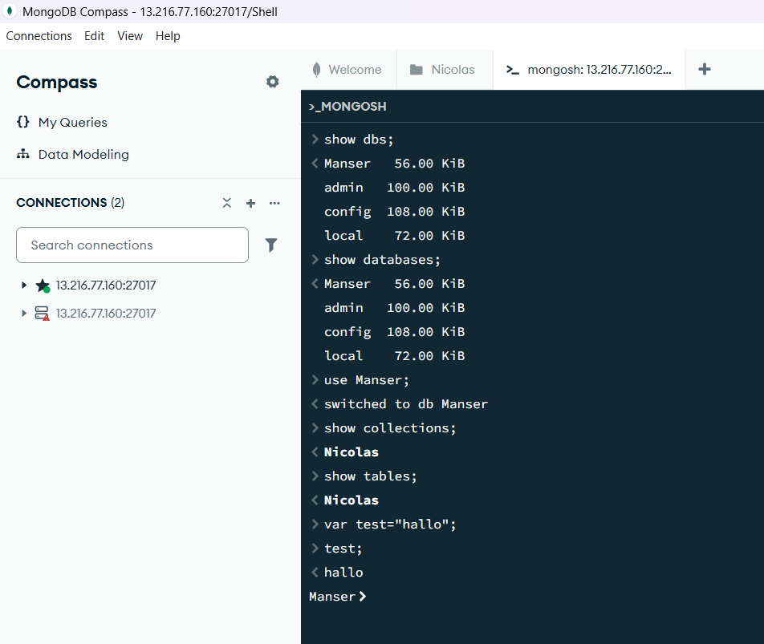

---

### 2. Skript zur Benutzererstellung

```javascript
// Benutzer 1: nur Lesen, gespeichert in Manser
use Manser
db.createUser({
  user: "leser",
  pwd: "leser123",
  roles: [{ role: "read", db: "Manser" }]
})

// Benutzer 2: Lesen & Schreiben, gespeichert in admin
use admin
db.createUser({
  user: "schreiber",
  pwd: "schreiber123",
  roles: [{ role: "readWrite", db: "Manser" }]
})
```

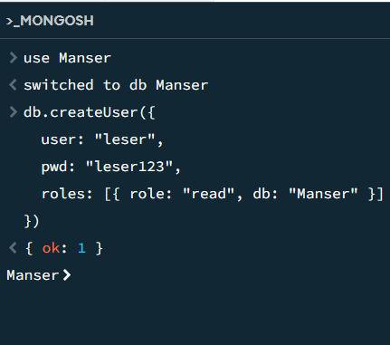

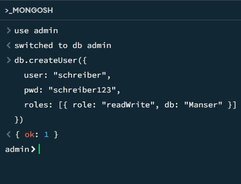

---

### 3. Benutzer 1 – Nur Lesen (`leser`)

Login (`authSource=Manser`):

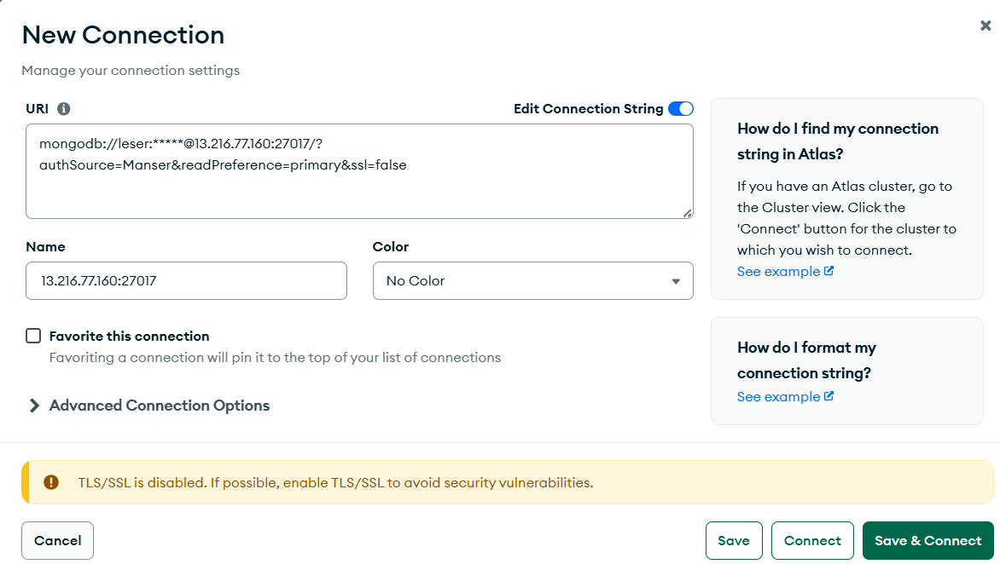

Lesen funktioniert:

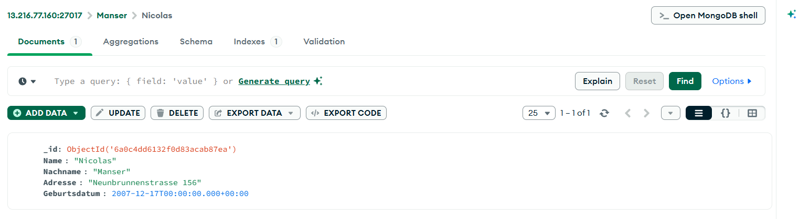

Schreiben = Fehler:

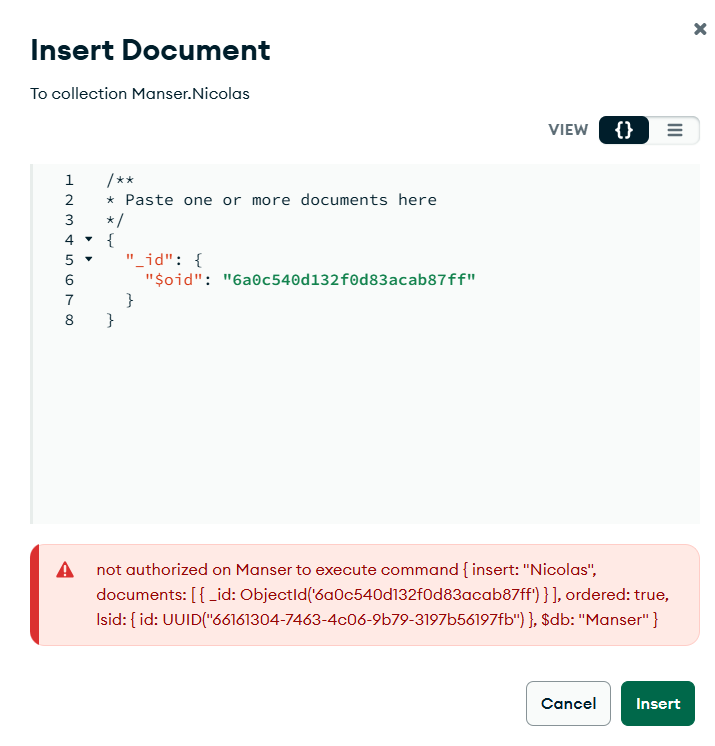

---

### 4. Benutzer 2 – Lesen & Schreiben (`schreiber`)

Login (`authSource=admin`):

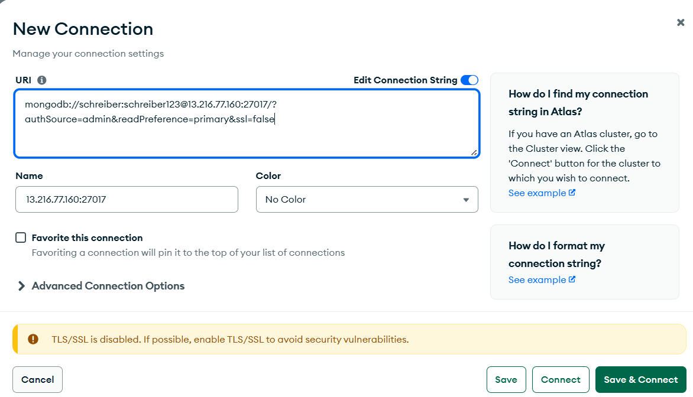

Lesen funktioniert auch beim admin

Schreiben funktioniert:

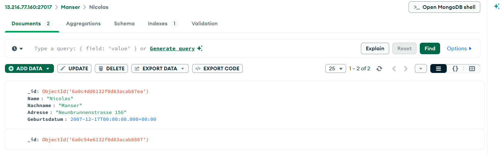
