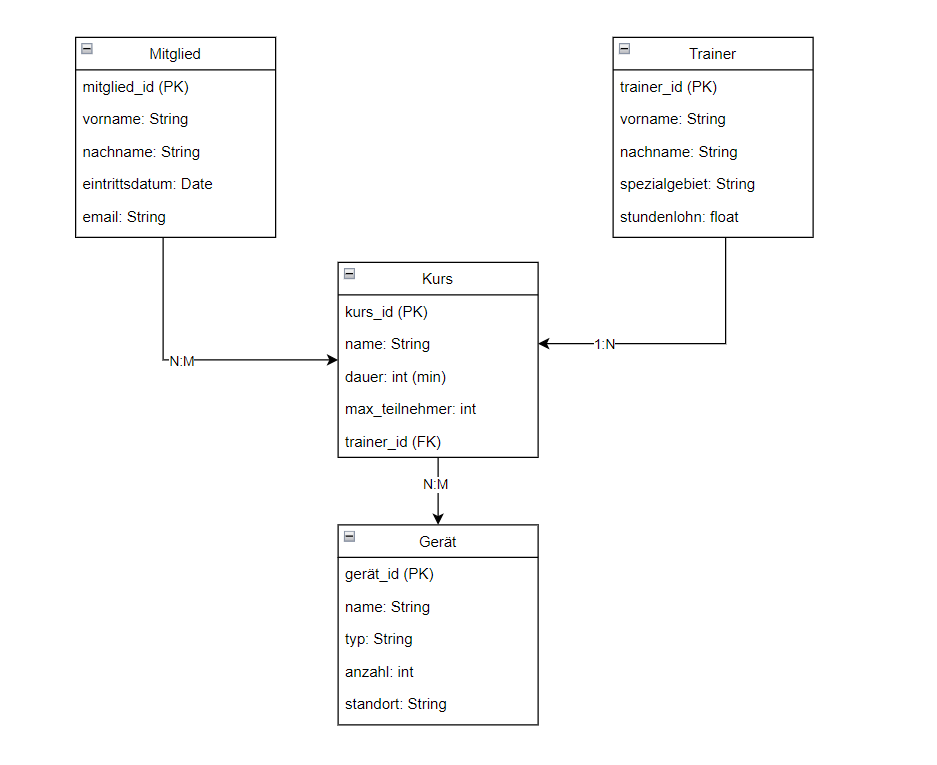
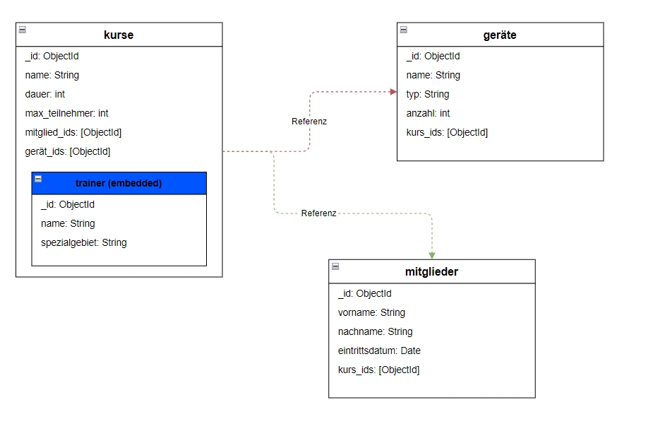
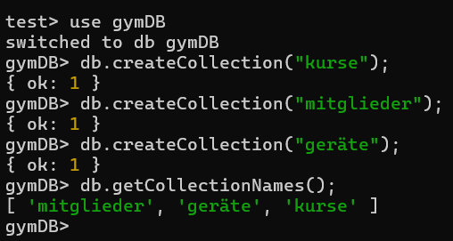

# KN-M-02: Datenmodellierung für MongoDB

## A) Konzeptionelles Datenmodell (30%)

### Diagramm



### Beschreibung

### Entitäten

- **Mitglied** – Personen die im Gym eingeschrieben sind
- **Trainer** – Trainer die Kurse leiten
- **Kurs** – Fitness-Kurse im Gym
- **Gerät** – Fitnessgeräte im Gym

### Beziehungen

- **Mitglied <=> Kurs (N:M)** – Ein Mitglied besucht mehrere Kurse und umgekehrt
- **Trainer => Kurs (1:N)** – Ein Trainer leitet mehrere Kurse
- **Kurs <=> Gerät (N:M)** – Ein Kurs nutzt mehrere Geräte und umgekehrt

---

## B) Logisches Modell für MongoDB (60%)

### Diagramm



### Beschreibung

### Embedding – Trainer in kurse

Der Trainer wird direkt in die `kurse`-Collection eingebettet, weil jeder Kurs genau einen Trainer hat und sich Trainer-Daten selten ändern. So kann ein Kurs mit allen Details in einer einzigen Abfrage gelesen werden.

### Referencing – Mitglied und Gerät

Für die N:M-Beziehungen wird Referencing mit bidirektionalen ObjectId-Arrays verwendet. Embedding wäre hier problematisch, da ein Mitglied viele Kurse besuchen kann und ein Kurs viele Mitglieder hat – das würde zu redundanten und riesigen Dokumenten führen. Mit Referencing kann man effizient von beiden Seiten abfragen:

- „Welche Kurse besucht Mitglied X?"
- „Welche Mitglieder hat Kurs Y?"

## C) Anwendung des Schemas in MongoDB (10%)

### Script: `create_collections.js`

**Schritt 1:** Zuerst wird separat der Befehl ausgeführt:

```javascript
use gymDB;
```

**Schritt 2:** Danach wird das Script ausgeführt, welches die Collections erstellt:

```javascript
db.createCollection("kurse");
db.createCollection("mitglieder");
db.createCollection("geraete");

db.getCollectionNames();
```

### Screenshot: Collections erstellt


