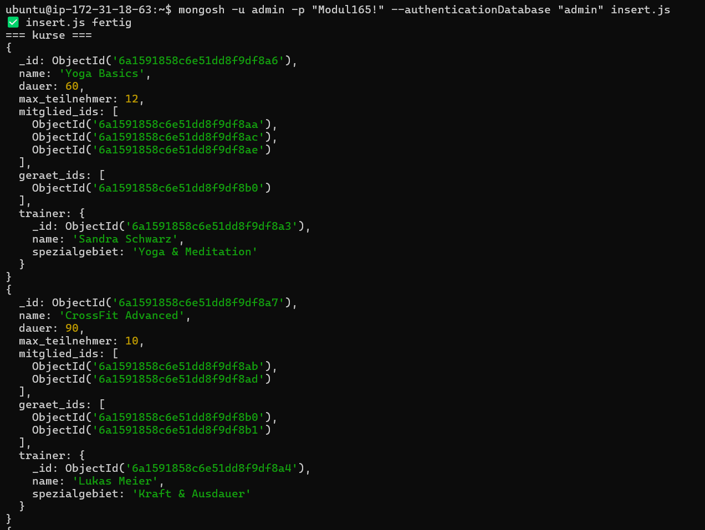
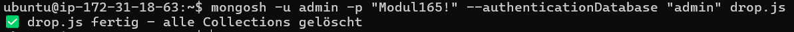
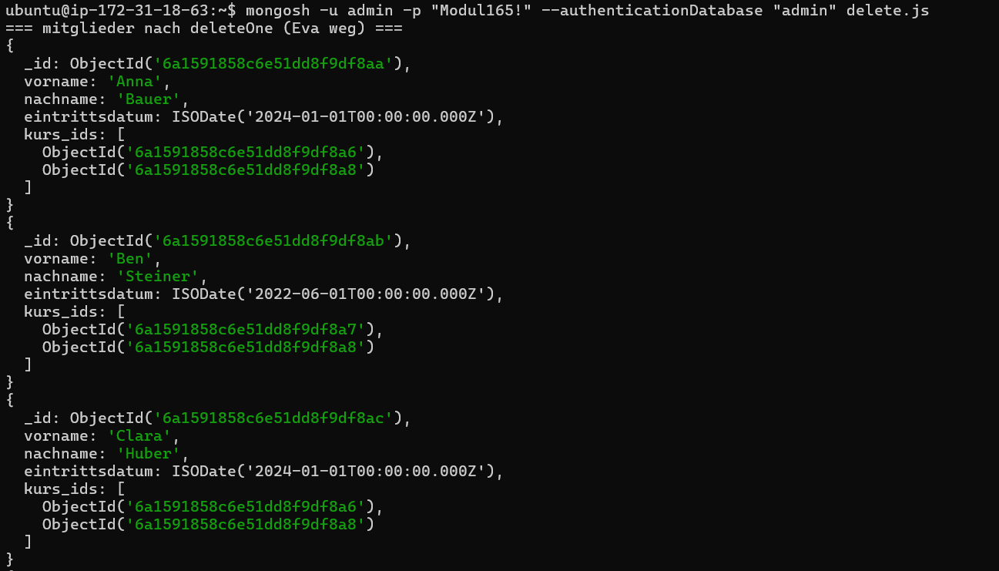
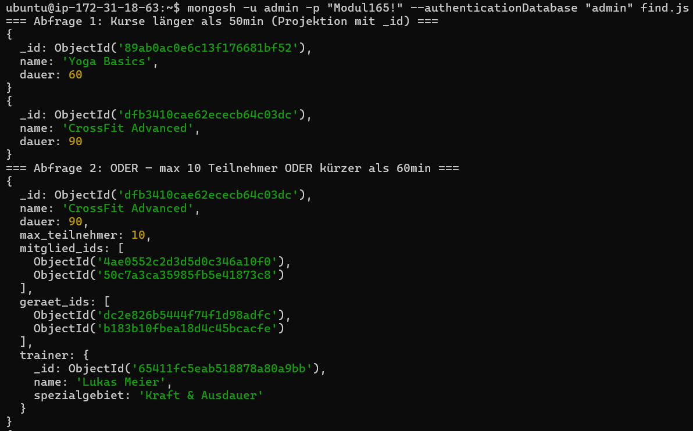
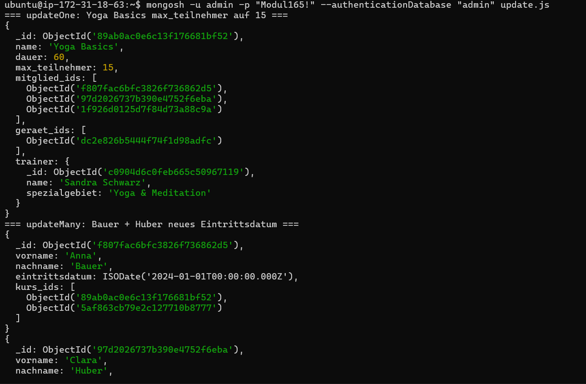

## A) Daten hinzufügen

**Skript:** `insert.js`

Fügt Datensätze in alle drei Collections ein. Alle ObjectIds werden als Variablen definiert und wiederverwendet.

- `insertOne()` wird für den ersten Kurs (Yoga Basics) und das erste Gerät (Laufband) verwendet
- `insertMany()` wird für die restlichen Kurse, alle Mitglieder und die restlichen Geräte verwendet
- Alle `_id`-Felder werden mit `ObjectId()` gesetzt, keine hartcodierten Werte

---

## B) Daten löschen

### B1 – Alle Collections löschen

**Skript:** `drop.js`

Löscht alle drei Collections mit `collection.drop()`.

### B2 – Einzelne Einträge löschen

**Skript:** `delete.js`

- `deleteOne()` – löscht das Mitglied "Eva Müller" anhand der `_id`
- `deleteMany()` – löscht "Rudergerät Concept2" und "Spinning Bike Elite" mit einer `$or`-Verknüpfung auf `_id`. Laufband und Hanteln bleiben erhalten.

---

## C) Daten abfragen

**Skript:** `find.js`

| Abfrage | Collection | Besonderheit                                  |
| ------- | ---------- | --------------------------------------------- |
| 1       | kurse      | Projektion **mit** `_id`                      |
| 2       | kurse      | `$or`-Verknüpfung (nicht auf `_id`)           |
| 3       | kurse      | Regex – Teilstring suchen                     |
| 4       | mitglieder | DateTime-Filterung, Projektion **ohne** `_id` |
| 5       | mitglieder | `$and`-Verknüpfung + Regex                    |
| 6       | geräte     | Projektion ohne `_id`                         |

---

## D) Daten verändern

**Skript:** `update.js`

- `updateOne()` auf Collection **kurse** – setzt `max_teilnehmer` von Yoga Basics auf 15, Filterung über `_id`
- `updateMany()` auf Collection **mitglieder** – aktualisiert das Eintrittsdatum von Bauer und Huber via `$or`, ohne `_id`
- `replaceOne()` auf Collection **geräte** – ersetzt "Laufband Pro 3000" vollständig durch "Laufband Pro 5000"

