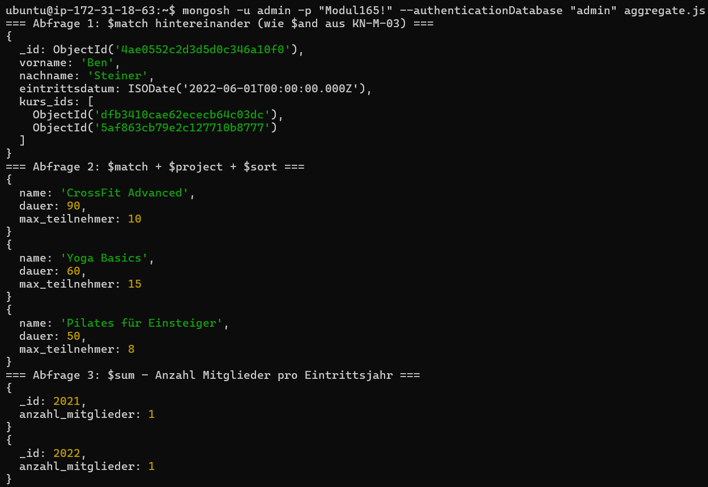
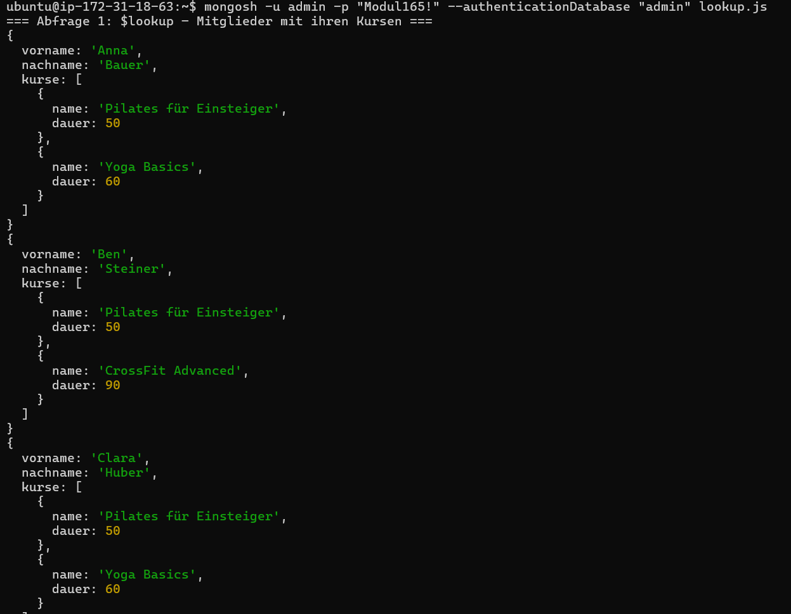
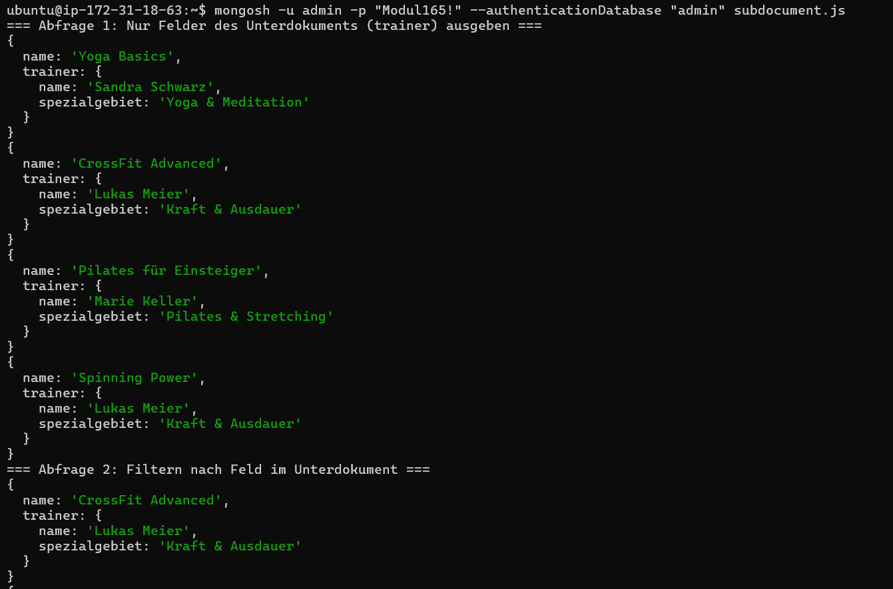

## A) Aggregationen

**Skript:** `aggregate.js`

| Abfrage | Anweisung                       | Beschreibung                                                                     |
| ------- | ------------------------------- | -------------------------------------------------------------------------------- |
| 1       | `$match` + `$match`             | Zwei hintereinandergeschaltete `$match`-Stages als Ersatz für `$and` aus KN-M-03 |
| 2       | `$match` + `$project` + `$sort` | Kurse länger als 45 Min, gefiltert, projiziert und nach Dauer sortiert           |
| 3       | `$group` + `$sum`               | Anzahl Mitglieder pro Eintrittsjahr zählen                                       |
| 4       | `$group` + `$sum`               | Gesamtanzahl Geräte pro Typ summieren                                            |

```bash
mongosh -u admin -p "Modul165!" --authenticationDatabase "admin" aggregate.js
```



---

## B) Join-Aggregation

**Skript:** `lookup.js`

| Abfrage | Anweisung                        | Beschreibung                                                              |
| ------- | -------------------------------- | ------------------------------------------------------------------------- |
| 1       | `$lookup` + `$project`           | Mitglieder mit ihren Kursen joinen, Felder beider Collections im Resultat |
| 2       | `$lookup` + `$match`             | Nur Mitglieder die in einem Kurs mit mehr als 60 Min sind                 |
| 3       | `$lookup` + `$project` + `$sort` | Kurse mit Geräten joinen, Anzahl Geräte pro Kurs ausgeben                 |

```bash
mongosh -u admin -p "Modul165!" --authenticationDatabase "admin" lookup.js
```



---

## C) Unter-Dokumente / Arrays

**Skript:** `subdocument.js`

Der Trainer ist als Unterdokument direkt in jedem Kurs eingebettet (`kurse.trainer`).

| Abfrage | Beschreibung                                                                              |
| ------- | ----------------------------------------------------------------------------------------- |
| 1       | Nur einzelne Felder des Unterdokuments (`trainer.name`, `trainer.spezialgebiet`) ausgeben |
| 2       | Nach Feld im Unterdokument filtern (`trainer.spezialgebiet` enthält "Kraft")              |
| 3       | `$unwind` auf `kurs_ids`-Array – verflacht die Ausgabe, pro Kurs-ID ein eigenes Dokument  |

```bash
mongosh -u admin -p "Modul165!" --authenticationDatabase "admin" subdocument.js
```


