## A) Rechte und Rollen

**Skript:** `create_users.js`

### A1 – Falscher authSource

Verbindungsversuch mit `authSource=gymDB` obwohl der `admin`-Benutzer in der `admin`-Datenbank gespeichert ist. MongoDB findet den Benutzer nicht und verweigert den Zugriff.

```bash
mongosh -u admin -p "Modul165!" --authenticationDatabase "gymDB"
```

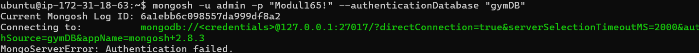

---

### A2 – Benutzer erstellen

Zwei neue Benutzer mit built-in Rollen (keine `anyDatabase`-Rollen):

| Benutzer        | Rolle       | authSource |
| --------------- | ----------- | ---------- |
| `leser_gym`     | `read`      | `gymDB`    |
| `schreiber_gym` | `readWrite` | `admin`    |

```bash
mongosh -u admin -p "Modul165!" --authenticationDatabase "admin" create_users.js
```

---

### A3 – Benutzer 1: leser_gym

Darf Daten nur lesen. Authentifizierungsdatenbank ist `gymDB`.

```bash
mongosh -u leser_gym -p "Leser123!" --authenticationDatabase "gymDB"
```

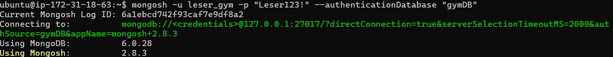

Lesen funktioniert ohne Fehler:

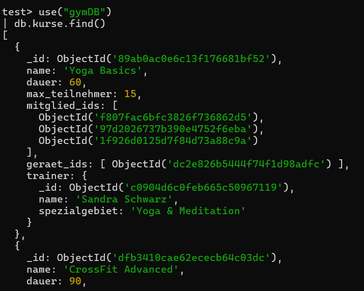

Schreiben gibt einen Fehler:

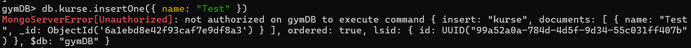

---

### A4 – Benutzer 2: schreiber_gym

Darf Daten lesen und schreiben. Authentifizierungsdatenbank ist `admin`.

```bash
mongosh -u schreiber_gym -p "Schreiber123!" --authenticationDatabase "admin"
```

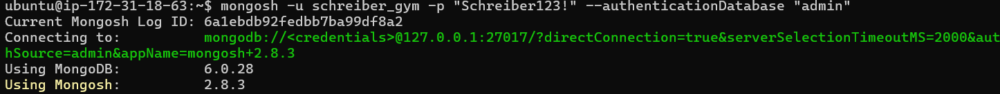

Lesen funktioniert ohne Fehler:

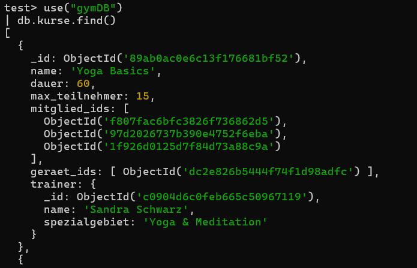

Schreiben funktioniert ohne Fehler:

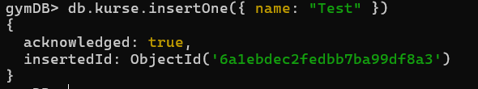

---

## B) Backup und Restore

### Variante 1 – AWS Snapshot

**Schritt 1 – Snapshot erstellen:**

In der AWS Console unter EC2 → Volumes → Actions → Create Snapshot. Beschreibung: `gymDB-backup`.

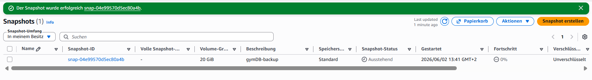

**Schritt 2 – Collection löschen:**

```bash
mongosh -u admin -p "Modul165!" --authenticationDatabase "admin" --eval 'use("gymDB"); db.mitglieder.drop();'
```

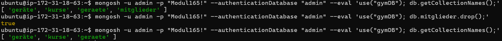

**Schritt 3 – Volume aus Snapshot erstellen und anhängen:**

In der AWS Console: Snapshots → Actions → Create volume from snapshot (gleiche Availability Zone). Danach Volumes → Actions → Attach volume.

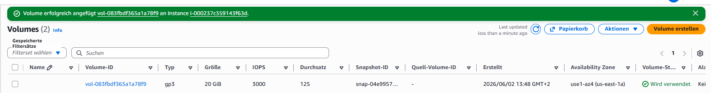

**Schritt 4 – Daten wiederherstellen:**

```bash
sudo mkdir /mnt/snapshot
sudo mount /dev/xvdf1 /mnt/snapshot
sudo systemctl stop mongod
sudo cp -r /mnt/snapshot/var/lib/mongodb/* /var/lib/mongodb/
sudo systemctl start mongod
```

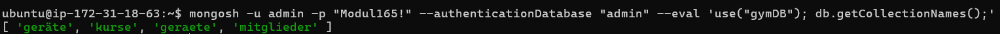

---

### Variante 2 – mongodump / mongorestore

**Schritt 1 – Backup erstellen:**

```bash
mongodump -u admin -p "Modul165!" --authenticationDatabase "admin" --db gymDB --out ~/backup
ls ~/backup/gymDB/
```

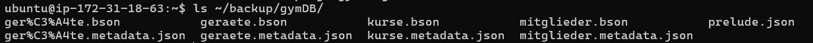

**Schritt 2 – Collection löschen:**

```bash
mongosh -u admin -p "Modul165!" --authenticationDatabase "admin" --eval 'use("gymDB"); db.geraete.drop();'
mongosh -u admin -p "Modul165!" --authenticationDatabase "admin" --eval 'use("gymDB"); db.getCollectionNames();'
```

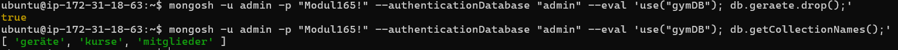

**Schritt 3 – Datenbank wiederherstellen:**

```bash
mongorestore -u admin -p "Modul165!" --authenticationDatabase "admin" --db gymDB ~/backup/gymDB/
mongosh -u admin -p "Modul165!" --authenticationDatabase "admin" --eval 'use("gymDB"); db.getCollectionNames();'
```

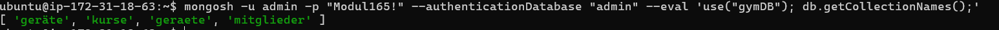

---

## C) Skalierung

### Replication vs. Sharding

**Replication (Replikation)** bedeutet, dass dieselben Daten auf mehreren Servern gespiegelt werden. In MongoDB nennt man das ein _Replica Set_. Es gibt einen primären Server der Schreiboperationen entgegennimmt, und mehrere sekundäre Server die eine Kopie der Daten haben. Fällt der primäre Server aus, übernimmt automatisch ein sekundärer. Replication erhöht also die **Verfügbarkeit** und **Ausfallsicherheit**, aber nicht die Kapazität – alle Server haben dieselben Daten.

**Sharding (Partitionierung)** bedeutet, dass die Daten auf mehrere Server aufgeteilt werden. Jeder Server (Shard) enthält nur einen Teil der Daten. Dadurch kann die Datenbank horizontal skalieren – also mehr Daten speichern und mehr Anfragen verarbeiten, indem man einfach weitere Shards hinzufügt. Sharding erhöht die **Kapazität** und **Performance**, aber jeder Shard hat die Daten nur einmal (ausser man kombiniert es mit Replication).

|            | Replication                  | Sharding                       |
| ---------- | ---------------------------- | ------------------------------ |
| Ziel       | Ausfallsicherheit            | Kapazität & Performance        |
| Daten      | Vollständig auf jedem Server | Aufgeteilt auf Server          |
| Skalierung | Vertikal / Leseanfragen      | Horizontal                     |
| Ausfall    | Automatischer Failover       | Einzelner Shard kann ausfallen |

### Empfehlung für die Firma

Unsere Applikation verwendet MongoDB mit der `gymDB`-Datenbank. Aktuell läuft sie auf einer einzelnen AWS-Instanz (t2.micro, 20GB). Die Datenmenge ist klein und die Anzahl gleichzeitiger Benutzer ist überschaubar.

**Empfehlung: Replication einführen, Sharding vorerst nicht.**

Ein Replica Set mit 3 Knoten (1 primär, 2 sekundär) wäre der sinnvolle nächste Schritt. Das erhöht die Ausfallsicherheit ohne grossen Mehraufwand. Falls die Datenmenge oder die Anzahl Benutzer stark wächst, kann man zu einem späteren Zeitpunkt Sharding hinzufügen. Aktuell wäre Sharding überdimensioniert und zu komplex für den Betrieb.

**Quellen:**

- https://www.mongodb.com/basics/scaling
- https://www.mongodb.com/docs/manual/replication/
- https://www.mongodb.com/docs/manual/sharding/
