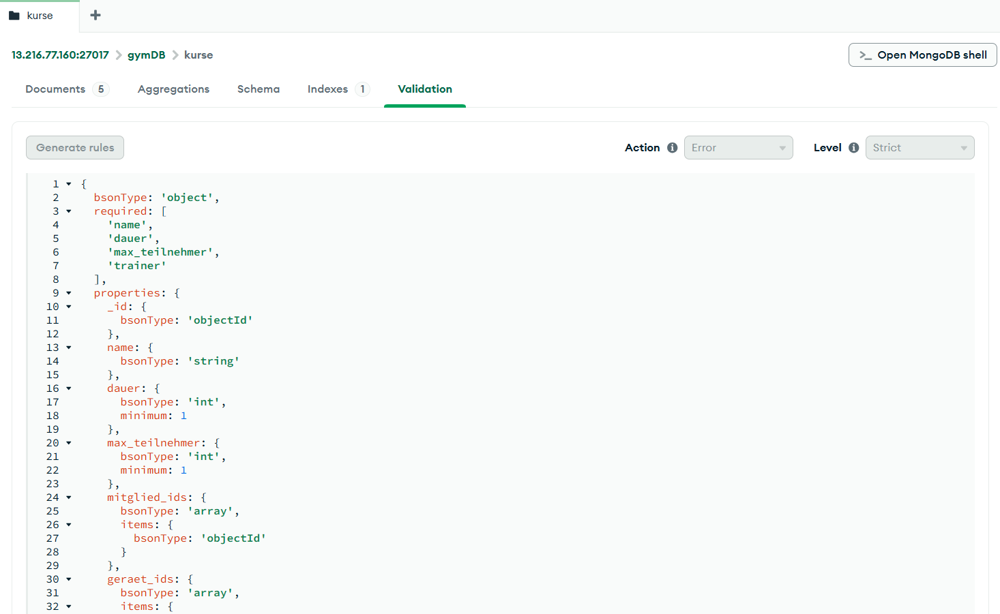
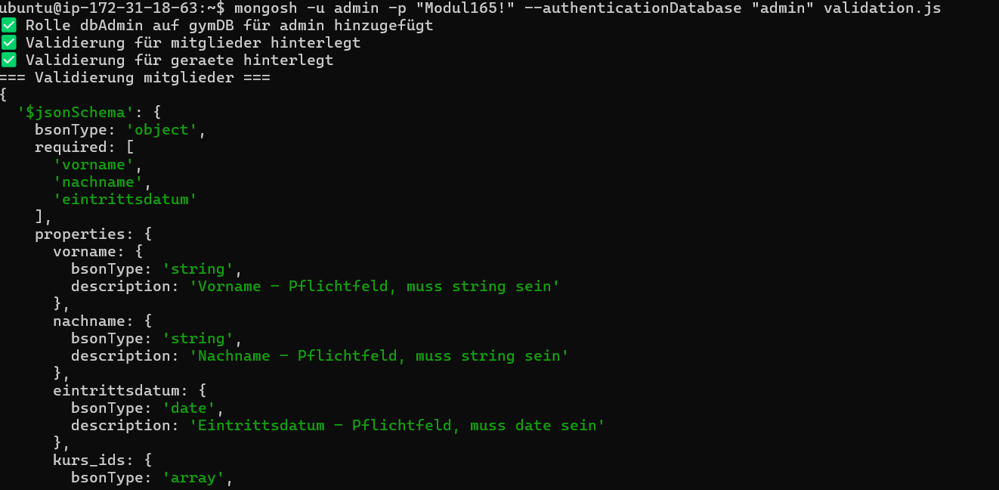
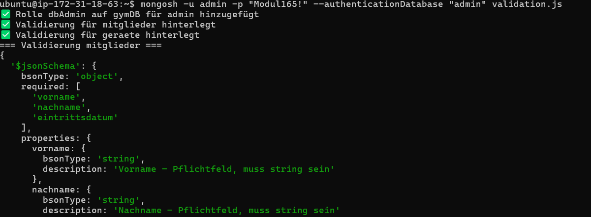

## A) JSON Schemas erstellen

Pro Collection wurde ein Beispiel-JSON und ein JSON-Schema erstellt.

| Collection | Beispiel-Datei             | Schema-Datei             |
| ---------- | -------------------------- | ------------------------ |
| kurse      | `beispiel_kurse.json`      | `schema_kurse.json`      |
| mitglieder | `beispiel_mitglieder.json` | `schema_mitglieder.json` |
| geraete    | `beispiel_geraete.json`    | `schema_geraete.json`    |

**Pflichtfelder pro Collection:**

| Collection | Pflichtfelder                                |
| ---------- | -------------------------------------------- |
| kurse      | `name`, `dauer`, `max_teilnehmer`, `trainer` |
| mitglieder | `vorname`, `nachname`, `eintrittsdatum`      |
| geraete    | `name`, `typ`, `anzahl`                      |

---

## B) Validierung hinterlegen und testen

**Skript:** `validation.js`

### Neue Rolle für admin

Damit Validierungen hinzugefügt werden können, braucht der admin-Benutzer die `dbAdmin`-Rolle auf der gymDB:

```javascript
use("admin");
db.grantRolesToUser("admin", [{ role: "dbAdmin", db: "gymDB" }]);
```

### Validierungen hinzufügen

Die Validierung für `kurse` wurde via Compass UI hinterlegt. Die Validierungen für `mitglieder` und `geraete` wurden via `mongosh` mit `collMod` hinterlegt:

```javascript
db.runCommand({
  collMod: "mitglieder",
  validator: { $jsonSchema: { ... } },
  validationLevel: "strict",
  validationAction: "error"
});
```



### Bestehende Validierung auslesen

```javascript
db.getCollectionInfos({ name: "mitglieder" })[0].options.validator;
```



### Validierung testen

```bash
mongosh -u admin -p "Modul165!" --authenticationDatabase "admin" validation.js
```

- Ungültiges Mitglied ohne Pflichtfelder → **Fehler**
- Gerät mit ungültigem Typ → **Fehler**
- Gültiges Mitglied → **Erfolgreich eingefügt**


