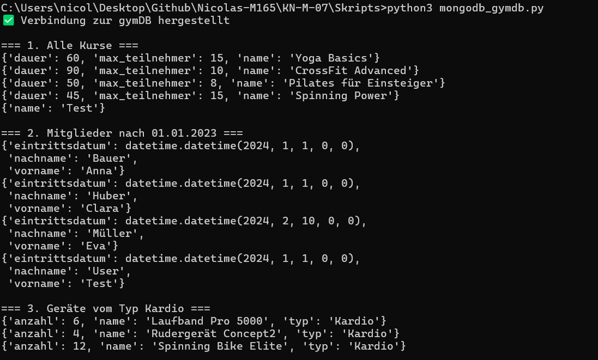

## KN-M-07: Programmierung mit MongoDB

**Skript:** `mongodb_gymdb.py`  
**Bibliothek:** pymongo  
**Sprache:** Python 3.11

### Installation

```bash
pip3 install pymongo
```

### Ausführen

```bash
python3 mongodb_gymdb.py
```

### Beschreibung

Das Skript verbindet sich von lokal direkt zur MongoDB-Instanz auf AWS und führt folgende Operationen aus:

| Schritt | Operation                         | Beschreibung               |
| ------- | --------------------------------- | -------------------------- |
| 1       | `find()`                          | Alle Kurse ausgeben        |
| 2       | `find()` + DateTime-Filter        | Mitglieder nach 01.01.2023 |
| 3       | `find()` + Filter                 | Geräte vom Typ Kardio      |
| 4       | `aggregate()` + `$group` + `$sum` | Anzahl Geräte pro Typ      |
| 5       | `insert_one()`                    | Neues Mitglied einfügen    |
| 6       | `update_one()`                    | Mitglied aktualisieren     |
| 7       | `delete_one()`                    | Mitglied löschen           |


