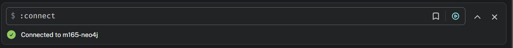
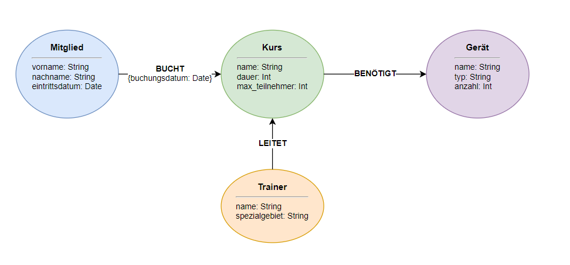

## A) Installation / Account erstellen

Für dieses Modul habe ich mich entschieden, die Neo4j AuraDB (Cloud Service) zu verwenden. Die Instanz wurde erfolgreich erstellt und gestartet. Der Screenshot zeigt die aktive Verbindung im Neo4j Browser ("Query"-Tab), wo die Datenbank bereit für Cypher-Abfragen ist.

---

## B) Logisches Modell für Neo4j

Das logische Datenmodell für meine Gym-Applikation wurde als Graph modelliert.

**Erklärung zum Modell und den Attributen:**
Für das logische Graph-Modell wurden die Entitäten aus dem ursprünglichen konzeptionellen Modell als Knoten (Nodes) modelliert: `Mitglied`, `Kurs`, `Trainer` und `Geraet`. Die Eigenschaften der jeweiligen Entitäten wurden als direkte Attribute auf den Knoten abgelegt (z.B. `vorname`, `nachname` auf dem Mitglied oder `name`, `dauer` auf dem Kurs), da sie Eigenschaften sind, die fix zum Objekt gehören.

**Attribut auf einer Kante (Relationship):**
Die Verbindung zwischen einem `Mitglied` und einem `Kurs` wird über die Kante `BUCHT` abgebildet. Das Attribut `buchungsdatum` wurde ganz bewusst auf diese Kante gelegt und nicht auf die Knoten.
_Grund:_ Das Buchungsdatum ist weder eine Eigenschaft des Mitglieds (da ein Mitglied viele Kurse an verschiedenen Tagen buchen kann) noch eine Eigenschaft des Kurses (da der Kurs von vielen Mitgliedern an unterschiedlichen Tagen gebucht wird). Das Datum beschreibt den exakten Moment der Beziehung (der Buchung) zwischen diesen beiden spezifischen Knoten und gehört in einer Graph-Datenbank zwingend auf die Kante.

_(Die Originaldatei `neo4j_modell.drawio` liegt der Abgabe bei)._

