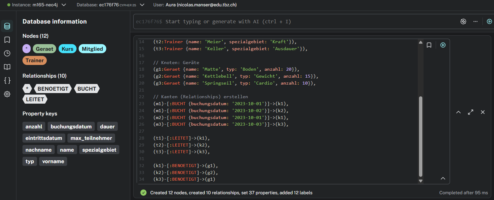
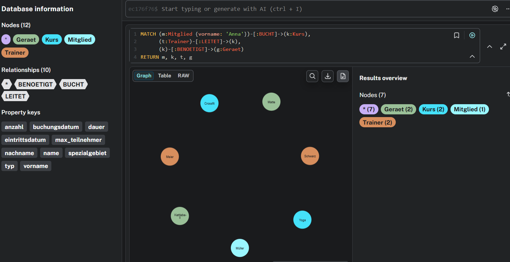
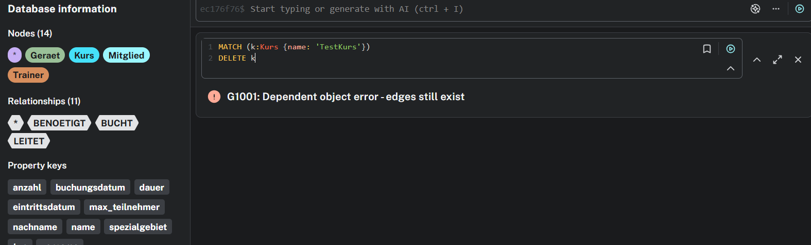
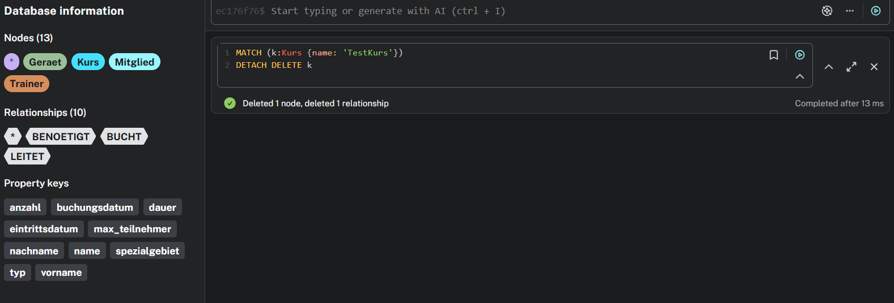
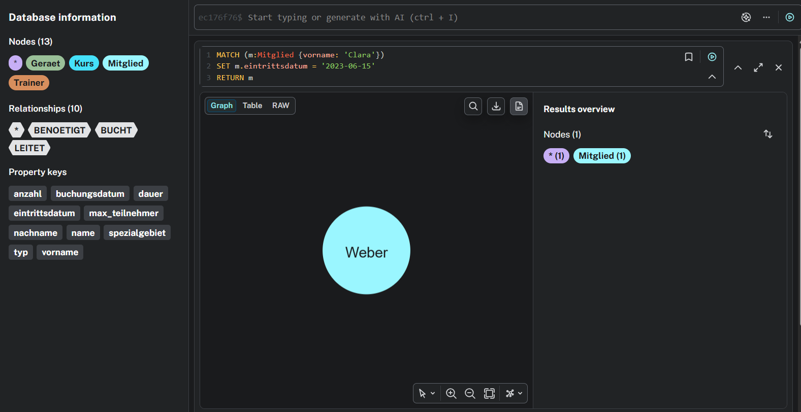
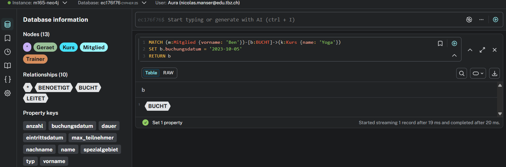
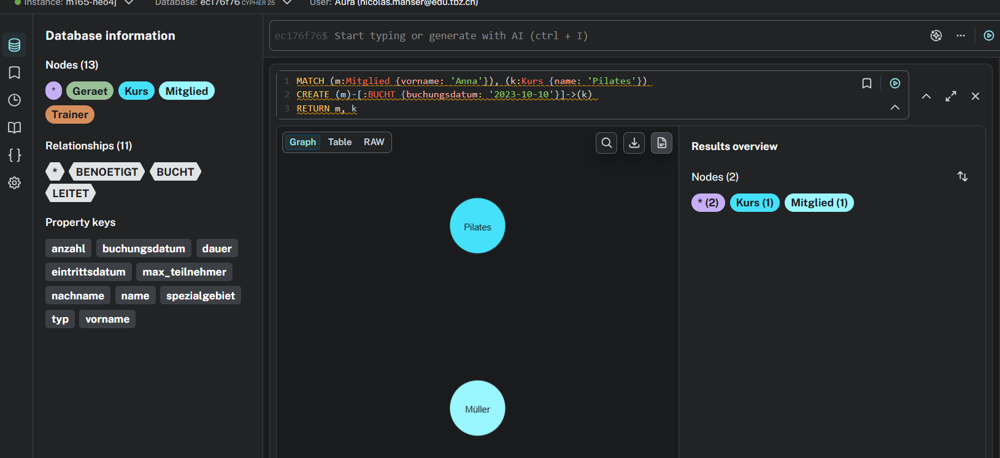

## A) Daten hinzufügen

Die Neo4j Datenbank wurde mit einem einzigen grossen `CREATE`-Statement gefüllt. Es wurden Knoten (Nodes) für Mitglieder, Kurse, Trainer und Geräte erstellt, sowie die dazugehörigen Kanten (Relationships) wie `BUCHT`, `LEITET` und `BENOETIGT` definiert.

---

## B) Daten abfragen

**Erklärung zu OPTIONAL MATCH:**
Die Abfrage `MATCH (n) OPTIONAL MATCH (n)-[r]->(m) RETURN n, r, m` liest den gesamten Graphen aus. Die `OPTIONAL MATCH`-Klausel verhält sich ähnlich wie ein `LEFT JOIN` in SQL. Wenn ein Knoten isoliert ist (also keine Kanten besitzt), wird er dank `OPTIONAL MATCH` trotzdem im Resultat angezeigt. Bei einem normalen `MATCH` würden isolierte Knoten herausgefiltert.

**Szenarios:**

1. **Knoten filtern:** Welche Mitglieder haben den Kurs 'Yoga' gebucht? (Verwendet `WHERE`).
2. **Kanten filtern:** Welche Mitglieder haben exakt am '2023-10-01' gebucht? (Verwendet `WHERE` auf Kanten-Attribut).
3. **Verkettung lesen:** Welche Trainingsgeräte werden für die Kurse benötigt, die von Trainer 'Meier' geleitet werden?
4. **Netzwerk lesen:** Das komplette Kurs-Netzwerk von Mitglied 'Anna' (Kurse, Trainer, Geräte).

---

## C) Daten löschen

Um das Löschen zu testen, wurde ein Dummy-Kurs mit einem Dummy-Trainer erstellt.

**Ohne DETACH (Fehler):**
Beim Versuch, den Knoten nur mit `DELETE k` zu löschen, blockiert Neo4j. Der Grund: Es hängt noch eine Kante am Knoten. Neo4j verhindert dies, um keine "Orphan Relationships" (Kanten ohne Ziel) zu hinterlassen.

**Mit DETACH (Erfolgreich):**
Der Befehl `DETACH DELETE k` weist die Datenbank an, zuerst alle verbundenen Kanten zu kappen und den Knoten erst danach zu löschen. Dies funktioniert reibungslos.

---

## D) Daten verändern

Folgende Update-Szenarien wurden umgesetzt:

1. **Knoten-Attribut:** Das Eintrittsdatum von Clara wurde nachträglich korrigiert.
2. **Kanten-Attribut:** Ben hat sein Buchungsdatum für Yoga verschoben. Hier wurde gezielt auf die Kante zugegriffen.
3. **Neue Kante:** Anna hat sich entschieden, zusätzlich Pilates zu buchen. Eine neue Relationship wurde in den bestehenden Graphen gezeichnet.

---

## E) Zusätzliche Klauseln

Zwei erweiterte Cypher-Klauseln wurden auf das Gym-Szenario angewendet:

**1. ORDER BY / LIMIT**

- **Erklärung:** Sortiert Ergebnisse auf- oder absteigend und limitiert die Rückgabemenge.
- **Szenario:** Der Manager möchte die Top 2 längsten Kurse im Gym ermitteln.
- **Befehl:** `MATCH (k:Kurs) RETURN k.name, k.dauer ORDER BY k.dauer DESC LIMIT 2`

**2. WITH**

- **Erklärung:** Dient als Pipeline innerhalb der Abfrage. Es reicht Resultate eines ersten Schrittes an einen zweiten Schritt weiter. Dies ist essenziell für Aggregationen (z.B. Zählen).
- **Szenario:** Zählen, wie viele Kurse jedes Mitglied insgesamt gebucht hat.
- **Befehl:** `MATCH (m:Mitglied)-[:BUCHT]->(k:Kurs) WITH m, count(k) AS anzahlKurse RETURN m.vorname, anzahlKurse`
