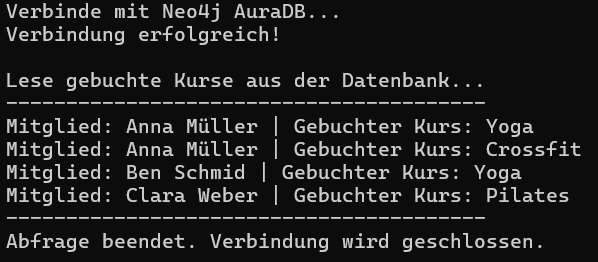

# Gym-DB: Neo4j & Python Integration (KN-N-03)

Dieses Projekt demonstriert die Anbindung einer Neo4j Graphdatenbank (AuraDB Cloud) an ein lokales Python-Skript. Es liest Daten über Mitglieder und deren belegte Kurse aus einem fiktiven Fitnessstudio aus.

## Voraussetzungen

- Python 3.x installiert
- Aktive Neo4j AuraDB Instanz (Cloud)
- Installierter Neo4j Python-Treiber

## Installation

Um den benötigten Treiber zu installieren, führe folgenden Befehl im Terminal aus:

```bash
pip install neo4j
```

